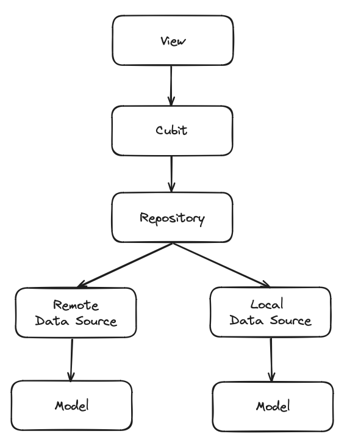

# FlutterCurrencyExchange

A Flutter Currency Exchange app made using the [Free Currency API](https://freecurrencyapi.com).

  

## Architecture and design
The project includes over 70 unit and widget tests and utilizes Cubits for state management, Get It for dependency injection, and other useful packages to facilitate testing. The architecture follows the image below:

 

## Getting Started

- Clone this project
- You need to have [Flutter](https://docs.flutter.dev/get-started/install) installed and set up to run the project.
- `cd` into the repo folder
- Run `flutter pub get` to install all dependencies
- Run the project (`flutter run`) and voila

